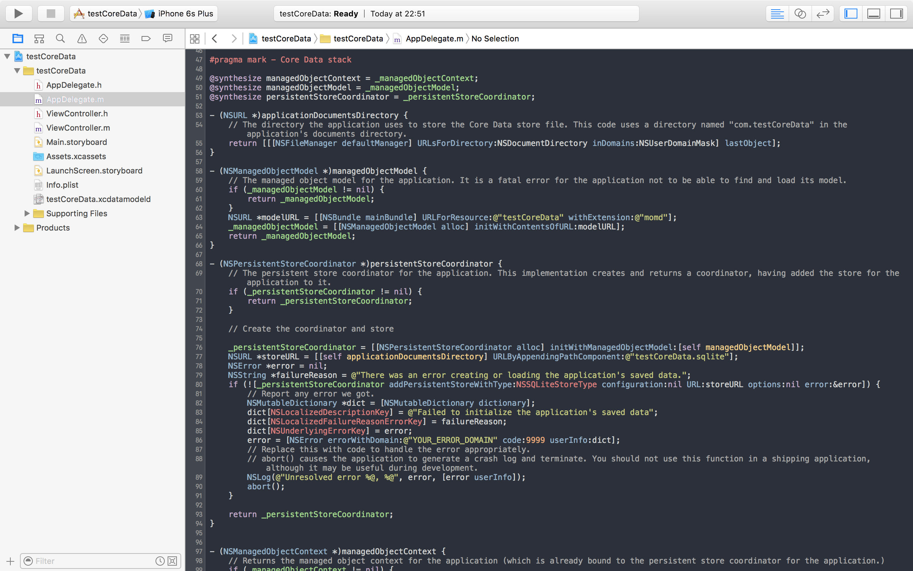
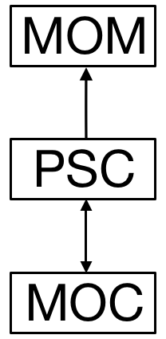
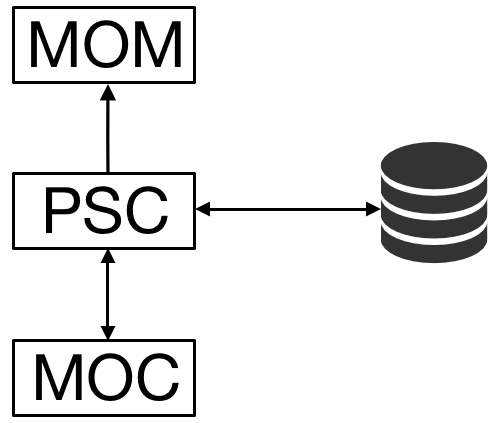
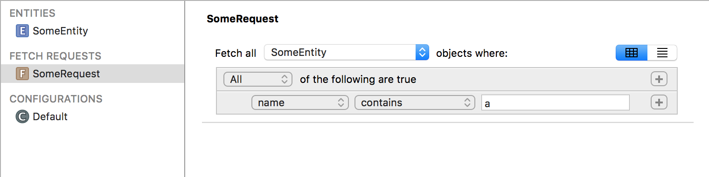
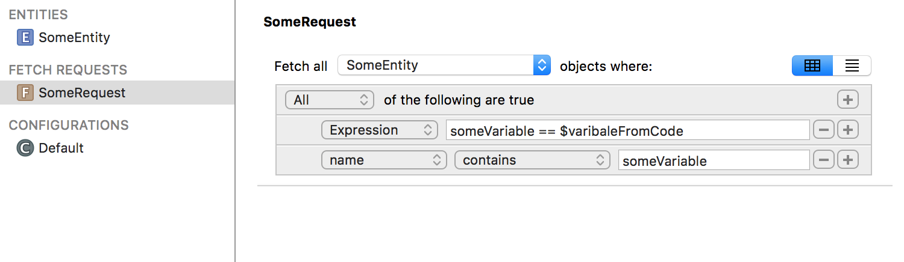
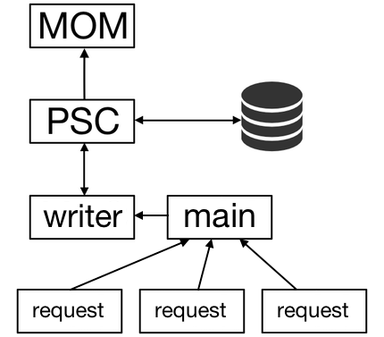
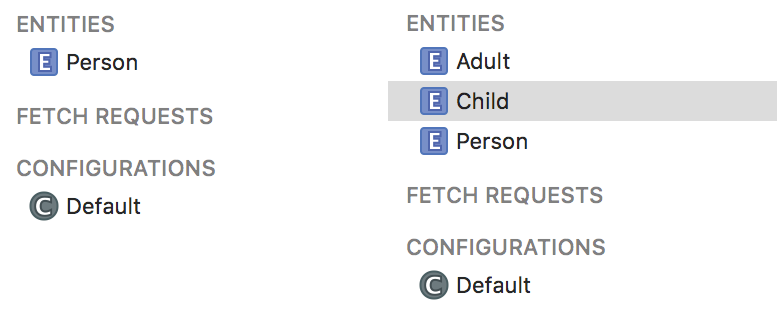
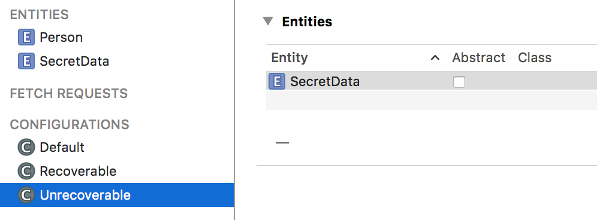
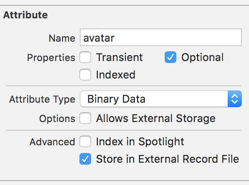

# Core Data Workshop

## Создания стека

#### Инициализация стека

CoreData смоделирована Apple в первую очередь не как база данных как таковая, а как framework работающий с графом объектов. Если посмотреть на экосистему Xcode, в разрезе паттерна `MVC`, то можно выделить, что Interface Builder это облегченное управление для `View`. Можно выкинуть целые простыни кода связанного с отрисовкой интерфейсов. Примерно с той же целью была создана и CoreData. Чтобы облегчить работу с `Model`. И когда начинаем работу с CoreData лучше всего так и представлять ее себе, как инструмент для управления графом данных. Она не быстрее всех остальных, Realm - быстрее, чистый SQLite - быстрее, но она достаточна быстра для любых задач на iOS. И этого хватает. 

Многих разработчиков отпугивает то чем представляется Core Data, когда ее добавляешь в проект: 



Но CoreData обладает более элегантным и простым API. Ее можно инициализировать буквально в 6 строк: 

``` objective-c
NSURL *modelURL = [[NSBundle mainBundle] URLForResource:@"model" withExtension:@"momd"];
NSAssert(modelURL != nil, @"Failed to find model");

NSManagedObjectModel *mom = [[NSManagedObjectModel alloc] initWithContentsOfURL:modelURL];
NSPersistentStoreCoordinator *psc = [[NSPersistentStoreCoordinator alloc] initWithManagedObjectModel:mom];

self.mainContext = [[NSManagedObjectContext alloc] initWithConcurrencyType:NSMainQueueConcurrencyType];
self.mainContext.persistentStoreCoordinator = psc;
```

Таким образом у нас получается схема такого вида: 



- **MOM**(`NSManagedObjectModel`) - скомпилированное, бинарное представление модели данных `*.xcdatamodeld`.
- **PSC**(`NSPersistentStoreCoordinator`) - серце всей CoreData: хранение, загрузка, кеширование данных и главное управление их представлением на диске.
- **MOC**(`NSManagedObjectContext`) - *snapshot* текущего состояниня `PSC`.

Даже после такого стека инициализации уже можно пользоваться CoreData. Она уже имеет структуру, которую мы описали в нашем файле модели. У нее есть всякого рода объекты и связи между ними. Она все еще не сохраняет свои данные на диск, но можно оперировать данными находясь в рамках `MOC`. Такого рода поведение может подойти если данные важны только в рамках одного цикла жизни приложения. Все данные после выхода из приложения будут удалены. 

> При попытке сохранения `NSManagedObjectModel` инициализированного с этим `NSPersistentStoreCoordinator` приложение упадет. Чтобы этого избежать, и сделать код приложение более понятным для чтения, можно инициализировать `NSPersistentStore` с типом `NSInMemoryStoreType`:
> 
> ``` objective-c
> NSPersistentStore *store = [psc addPersistentStoreWithType:NSInMemoryStoreType configuration:nil URL:storeURL options:options error:&error];
> ```
> 
>  что скажет хранить все данные только в памяти. И в таком случае будет проще работать с контекстами. 

#### NSPersistentStore

Добавим место для хранения:

``` objective-c
NSFileManager *fileManager = [NSFileManager defaultManager];
NSError *error = nil;
NSURL *docURL = [fileManager URLForDirectory:NSDocumentDirectory inDomain:NSUserDomainMask appropriateForURL:nil create:NO error:&error];
NSAssert(docURL != nil, @"Failed to find documents directory");
NSURL *storeURL = [docURL URLByAppendingPathComponent:@"Data.sqlite"];

NSPersistentStore *store = [psc addPersistentStoreWithType:NSSQLiteStoreType configuration:nil URL:storeURL options:options error:&error];
if (store == nil) {
  NSLog(@"Failed: %@\n%@", [error localizedDescription], [error userInfo]);
  abort();
}
```

> Здесь Маркус обратил наше внимание, что он считает лучше убить приложение (пользователь это увидит и перезапустит приложение), чем дать пользователю работать в неопределенном состоянии. Когда он может работать со своими уникальными, невосстанавливаемыми данными и после выхода из приложения остаться ни с чем. Поэтому он тут вставил `abort();`
> 
> Сохранность пользовательских данных он для себя ставит во главу угла. Он сказал, что не хочет проснуться ночью от того, что ему будут писать злые пользователи с жалобами на пропавшие данные.  



Так на инициализацию приложения система выделяет ограниченное количество времени, а наша CoreData инициализируются в `application:didFinishLaunchingWithOptions:`. Хорошо бы уменьшить время на ее инициализацию. И для этого можно вынести добавление `NSPersistentStore` в фон.

``` objective-c
dispatch_async(dispatch_get_global_queue(DISPATCH_QUEUE_PRIORITY_BACKGROUND, 0), ^{
	NSFileManager *fileManager = [NSFileManager defaultManager];
	NSError *error = nil;
	NSURL *docURL = [fileManager URLForDirectory:NSDocumentDirectory inDomain:NSUserDomainMask appropriateForURL:nil create:NO error:&error];
	NSAssert(docURL != nil, @"Failed to find documents directory");
	NSURL *storeURL = [docURL URLByAppendingPathComponent:@"Data.sqlite"];

	NSPersistentStore *store = [psc addPersistentStoreWithType:NSSQLiteStoreType 	configuration:nil URL:storeURL options:options error:&error];
	if (store == nil) {
    	NSLog(@"Failed: %@\n%@", [error localizedDescription], [error userInfo]);
  		abort();
	}
});
```

#### Сохранение

В самом обычном случае сохранение делается очень просто:

``` objective-c
NSError *error = nil;
if ([self.mainContext hasChanges]) {
    if (![self.mainContext save:&error]) {
        NSLog(@"Failed: %@\n%@", [error localizedDescription], [error userInfo]);
        abort();
    }
}
```

> `abort();` добавлен для подстраховки во время разработки. Как сказал Маркус ошибка при сохранении крайне маловероятна и происходит очень редко. Самые возможные варианты: 
> 
> - В `NSManagedObjectContex` хранятся какие-то неверные данные.
> - Во время мерджа что-то пошло не так, и как следствие неверные данные.
> - Нехватка места на диске. Но тут он рассмеялся и сказал, что в текущих реалиях это абсолютно невозможная ситуация.

#### NSMangedObject

Единственное, что хотелось бы упомянуть про `NSMangedObject` это то, что у него не вызывается `dealloc`. Вместо это его свойство `fault` выставляется как `YES`.

#### NSFetchRequest

> Здесь, как всегда, Маркус рекомендовал не использовать в `NSPredicate` строковые поля, чтобы приложение не теряло в производительности.

Главным посылом Маркуса было то, что лучше всего все запросы (`NSFetchRequest`) к CoreData хранить в файле модели вместе со всем остальным:

  Потом их можно загрузить при помощи метода `fetchRequestTemplateForName:`. 

``` objective-c
NSFetchRequest *fetch = [_managedObjectModel fetchRequestTemplateForName:@"SomeRequest"];
```



Так же можно создать `NSFetchRequest` с переменными и подменить их уже из кода при помощи метода `fetchRequestFromTemplateWithName:substitutionVariables:`. 

``` objective-c
NSFetchRequest *fetch = [_managedObjectModel fetchRequestTemplateWithName:@"SomeRequest" substitutionVariables:@{@"variableFromCode" : @"a"}];
```

> Предикаты загруженного запроса можно комбинировать ос своими.

## NSFetchedResultsController

#### Инициализация

Когда CoreData добавили для iOS было понятно, что она будет тесно взаимодействовать с `UITableView`. И поэтому для того, чтобы эти два компонента гладко работали вместе был создан `NSFetchedResultsController`. Это своего рода склейка между CoreData и `UITableView`. 

Первое предназначение `NSFetchedResultsController` - подтягивание данные из CoreData и хранение их для последующего доступа. Этот класс группирует возвращаемые данные по секциям, что делает эти данные очень полезными в `UiTableView`. 

Второе - это наблюдение за изменениями в данных, которыми он оперирует. Каждый раз, когда данные меняются, `NSFetchedResultsController` оповещает своего делегата об этом. Обычно этим делегатом выступает `UITableViewController`.

``` objective-c
NSFetchRequest *fetch = [NSFetchRequest fetchRequestWithEntityName:@"Person"];
[fetch setSortDescriptors:@[[NSSortDescriptor sortDescriptorWithKey:@"firstName" ascending:YES]]];

NSManagedObjectContext *moc = self.dataController.mainContext;
NSFetchedResultsController *frc = nil;

frc = [[NSFetchedResultsController alloc] initWithFetchRequest:fetch managedObjectContext:moc sectionNameKeyPath:nil cacheName:nil];
frc.delegate = self;
self.fetchedResultsController = frc;

NSError *error = nil;
if (![frc performFetch:&error]) {
    NSLog(@"Error: %@\n%@", [error localizedDescription], [error userInfo]);
    abort();
}
```

> `abort();` опять добавлен только для отладки во время разработки.

Так выглядит самая примитивная инициализация `NSFetchedResultsController`. Если вспомнить, что `NSFetchedResultsController` был разработан в основоном для `UITableView`, то будет понятно, что лучше всего его инициализировать с `NSManagedObjectContext` работающим на главном потоке. Так же можно заметить параметр `sectionNameKeyPath`. Как не сложно догадаться он отвечает за разбитие данных по секциям. Выступать таким параметром может любое поле нашего `Entity`. Но стоит заметить, что если мы передаем `sectionNameKeyPath` отличное от `nil`, то мы должны добавить `NSSortDescriptor` по этому полю в наш инициализирующий `NSFetchRequest`. 

``` objective-c
NSSortDescriptor *sort = [NSSortDescriptor sortDescriptorWithKey:@"name" ascending:NO];
fetch.sortDescriptors = @[sort];
```

`NSFetchedResultsController` сам реализуют кеш, мы только указываем ему имя. Этот кеш очень чувствителен к изменениям в данных. Лучше всего он себя показывает если мы, к примеру, перестраиваем ячейки `UITableView`, чтобы они начали отображать новый елемент, но наши данные в этот момент не меняются.

После инициализации мы вызываем `performFetch:` этот метод подтягивает данные в `NSFetchedResultsController`. Вызов этого метода можно опустить, и сделать его уже в момент, когда он меньше всего ударит по производительности. Но не стоит забывать вызывать его до того как `UITableView` начнет запрашивать данные. Будет досадно, когда пользователю прийдется ждать свои данные.

#### Реализация UITableViewSource

API `NSFetchedResultsController` очень легко помогает реализовать методы `UITableViewDataSource` протокола.

``` objective-c
- (NSInteger)numberOfSectionsInTableView:(UITableView *)tableView
{
    return [[self.fetchedResultsController sections] count];
}
```

> Если в инициализации `NSFetchedResultsController` не передавать `sectionNameKeyPath`, то секция будет одна.

``` objective-c
- (NSInteger)tableView:(UITableView *)tableView numberOfRowsInSection:(NSInteger)section
{
    id <NSFetchedResultsSectionInfo> sectionInfo = self.fetchedResultsController.sections[section];
    return [sectionInfo numberOfObjects];
}

- (UITableViewCell *)tableView:(UITableView *)tableView cellForRowAtIndexPath:(NSIndexPath *)indexPath
{
    static NSString *identifier = @"Cell";
    UITableViewCell *cell = [tableView dequeueReusableCellWithIdentifier:identifier];
    if (!cell) {
        cell = [[UITableViewCell alloc] initWithStyle:UITableViewCellStyleDefault reuseIdentifier:identifier];
    }

    SomeEntity *object = [self.fetchedResultsController objectAtIndexPath:indexPath];
    [cell.textLabel setText:object.name];

    return cell;
}
```

#### NSFetchedResultsControllerDelegate

Но самое приятное в `NSFetchedResultsController` это конечно же легкое и автоматическое данных. Для этого нам нужно реализовать несколько методов `NSFetchedResultsControllerDelegate`.  

``` objective-c
- (void)controllerWillChangeContent:(NSFetchedResultsController *)controller
{
    [[self tableView] beginUpdates];
}

- (void)controller:(NSFetchedResultsController *)controller
  didChangeSection:(id <NSFetchedResultsSectionInfo>)sectionInfo
           atIndex:(NSUInteger)sectionIndex
     forChangeType:(NSFetchedResultsChangeType)type
{
    switch(type) {
        case NSFetchedResultsChangeInsert:
            [[self tableView] insertSections:[NSIndexSet indexSetWithIndex:sectionIndex] withRowAnimation:UITableViewRowAnimationFade];
            break;

        case NSFetchedResultsChangeDelete:
            [[self tableView] deleteSections:[NSIndexSet indexSetWithIndex:sectionIndex] withRowAnimation:UITableViewRowAnimationFade];
            break;
    }
}

- (void)controller:(NSFetchedResultsController *)controller
   didChangeObject:(id)anObject
       atIndexPath:(NSIndexPath *)indexPath
     forChangeType:(NSFetchedResultsChangeType)type
      newIndexPath:(NSIndexPath *)newIndexPath
{
    switch(type) {
        case NSFetchedResultsChangeInsert:
            [[self tableView] insertRowsAtIndexPaths:[NSArray arrayWithObject:newIndexPath] withRowAnimation:UITableViewRowAnimationFade];
            break;

        case NSFetchedResultsChangeDelete:
            [[self tableView] deleteRowsAtIndexPaths:[NSArray arrayWithObject:indexPath] withRowAnimation:UITableViewRowAnimationFade];
            break;

        case NSFetchedResultsChangeUpdate:
        {
            UITableViewCell *cell = [[self tableView] cellForRowAtIndexPath:indexPath];
            [self configureCell:cell forIndexPath:indexPath];
            break;

        }
        case NSFetchedResultsChangeMove:
            [[self tableView] deleteRowsAtIndexPaths:[NSArray arrayWithObject:indexPath] withRowAnimation:UITableViewRowAnimationFade];
            [[self tableView] insertRowsAtIndexPaths:[NSArray arrayWithObject:newIndexPath]withRowAnimation:UITableViewRowAnimationFade];
            break;
    }
}

- (void)controllerDidChangeContent:(NSFetchedResultsController *)controller
{
    [[self tableView] endUpdates];
}
```

> Маркус предлагает также добавить `NSAssert` в `controllerDidChangeContent`. Этот `NSAssert` должне проверять время, которое прошло со времени вызова `controllerWillChangeContent`. Опять же только для того, чтобы отслеживать быстродействие своего приложения во время разработки.

Если посмотреть на реализацию этого протокола, то она почти полностью состоит из вызовов нативных API `UITableView`. И будет выглядеть одинаковой для всех таблиц в 99% случаев. Странно почему Apple сами не реализовали API более высокого уровня для совместной работы этих двух компонентов. Как это сделано, к примеру, в [DTCollectionViewManager](https://github.com/DenHeadless/DTCollectionViewManager).

Такая простая имплементация протокола решает все вопросы связанные с заполнением, удаление, обновлением данных для наших таблиц. `NSFetchedResultsController` помогает отлично разделить модель и представление. Теперь мы можем работать только с самой CoreData: добавлять, удалять, обновлять данные, а все изменения сразу же будут отображены в нашей таблице. 

> Имена для секций будут взяты точно такие же, какие значения записаны у этого объекта в CoreData. Но `NSFetchedResultsControllerDelegate` дает возможность преопределить такое поведение. Если мы имплементируем  `controller:sectionIndexTitleForSectionName:` мы можем исправить текущее имя, либо вообще возвращать совершенно другое.
> 
> ``` objective-c
> - (NSString *)controller:(NSFetchedResultsController *)controller sectionIndexTitleForSectionName:(NSString *)sectionName
> {
>     return [sectionName stringByAppendingString:@"!"];
> }
> ```

## Многопоточность

#### Типы NSManagedObjectContext

Core Data, а именно `NSManagedObjectContext` не потокобезопасны. Поэтому если использовать `NSManagedObjectContext` в главном потоке и с большими нагрузками, то можно получить проблемы с производительностью. Для этого нужно использовать разные контексты для разных потоков. Но так же не стоит забывать, что полностью уйти в фон нельзя. Должен оставаться поток, который будет работать с UI в главном потоке. 

После iOS 5 с многопоточность в CoreData стало все намного проще. Для того чтобы создать `NSManagedObjectContext` работающий в том или ином потоке достаточно просто это указать в его инициализаторе.

``` objective-c
self.mainContext = [[NSManagedObjectContext alloc] initWithConcurrencyType:NSMainQueueConcurrencyType];
```

- **NSMainQueueConcurrencyType** - контекст будет ассоциирован с главным потоком.
- **NSPrivateQueueConcurrencyType** - контекст будет ассоциирован с фоновой очередью.
- **NSConfinementConcurrencyType** - значение по-умолчанию. Контекст будет ассоциирован с потоком, в котором был создан. Это значение устарело в iOS 9.

#### Parent-Child contexts

Теперь мы можем реализовать два контекста для нашего приложения. Первый будет заниматься только записью данных на диск, а второй будет работать с главным/UI потоком.

``` objective-c
self.writerContext = [[NSManagedObjectContext alloc] initWithConcurrencyType:NSPrivateQueueConcurrencyType];
self.writerContext.persistentStoreCoordinator = psc;

self.mainContext = [[NSManagedObjectContext alloc] initWithConcurrencyType:NSMainQueueConcurrencyType];
self.mainContext.parentContext = self.writerContext;
```

В таком случае можно воспринимать `self.mainContext` как снимок `self.writerContext`. И при сохранении `self.mainContext` все его изменения будут просто пушнуты в `self.writerContext` и никак не повлияют на данные хранящиеся на диске.

> Но изменения которые происходят в `self.writerContext` уже никак не могут коснуться `self.mainContext`.  Для того чтобы использовать новые данные, которые пришли в `self.writerContext` нужно создавать уже новый контекст.

Теперь для данных, которые мы получаем удаленно и хотим обрабатывать в фоне, нужно будет создавать отдельный контекст на каждый из запросов. 

``` objective-c
NSManagedObjectContext *someContext = [[NSManagedObjectContext alloc] initWithConcurrencyType:NSPrivateQueueConcurrencyType];
someContext.parentContext = self.mainContext;
```



> Слияние данных происходит автоматически. Допустим если у нас в `mainContext` есть какие-то данные и нам необходимо сделать несколько запросов. Мы делаем первый и создаем `requestContext1` и для второго запроса - `requestContext2`. Сначала в `requestContext1` мы удаляем какой-либо объект, сохраняем контекст. Потом в `requestContext2` этот объект у нас еще жив и мы решаем обновить какие-либо его поля, потом сохраняем. После сохранения `requestContext1` этот объект будет удален в `mainContext`, но после сохранения `requestContext2` он появится и уже будет обновленный.

#### Сохранение

В iOS 5 были добавлены также два метода `performBlock:` и `performBlockAndWait:` для облегчения мультипоточной работы с CoreData.

- `performBlock:` - позволяет выполнить блок кода на потоке, ассоциированном с этим контекстом, находясь даже на любом другом потоке. Вызов этого метода не блокирует вызывающий его поток. Если вызвать вложенный `performBlock:` то он добавится только в конец очереди и не будет выполнен сразу.
- `performBlockAndWait:` - делает тоже самое, что и `performBlock:`, но уже блокирует поток, на котором был вызван. Вложенные вызовы будут работать корректно, т.е. сначала выполнится вложенный вызов, а только после этого родительский.

Теперь нам необходимо переписать наш метод сохранения, чтобы он корректно работал для наших двух контекстов:

``` objective-c
NSError *error = nil;
[self.mainContext performBlockAndWait:^{
    if ([self.mainContext hasChanges]) {
        if (![self.mainContext save:&error]) {
            NSLog(@"Failed: %@\n%@", [error localizedDescription], [error userInfo]);
            abort();
        }
    }
}];

[self.writerContext performBlock:^{
    if ([self.writerContext hasChanges]) {
        if (![self.writerContext save:&error]) {
            NSLog(@"Writer context failed: %@\n%@", [error localizedDescription], [error userInfo]);
            abort();
        }
    }
}];
```

## Миграция

CoreData для каждого Entity делает хеш. И при каждой загрузки с диска проверяет его и на основе этого решает делать ли миграцию или нет. Есть несколько свойств которые не вызывают изменения хеша для Entity:

- Изменение имени класса, который ассоциирован с этим Entity.
- Transient properties.
- Предикаты для валидации.
- Значения по-умолчанию.

Миграция делится на два вида: легкая и тяжелая. Всегда и любой ценной стоит избегать тяжелой миграции. Это очень затратно по времени как для пользователя так и для разработчиков. Если сравнивать миграцию с точки зрения производительности на пользовательском устройстве, то легкая оказывается в разы проще тяжелой. Для тяжелой миграции CoreData выгружают всю базу в память, создает новые Entity, создает связи между ними и в конце уже валидирует новую базу и записывает на ее диск. Для легкой миграции всего этого не происходит: нет затрат по времени, памяти. Все происходит автоматически и гораздо быстрее. Все что необходимо для легкой миграции - это указать правильно опции: 

``` objective-c
NSDictionary *options = @{NSMigratePersistentStoresAutomaticallyOption : @(YES),
                          NSInferMappingModelAutomaticallyOption : @(YES)};

NSPersistentStore *store = [psc addPersistentStoreWithType:NSSQLiteStoreType configuration:nil URL:storeURL options:options error:&error];
```

- **NSMigratePersistentStoresAutomaticallyOption** - говорит CoreData делать ли автоматическую миграцию или нет.
- **NSInferMappingModelAutomaticallyOption** - если нету `NSMappingModel` будет делать автоматический маппинг.

Для того чтобы избежать тяжелой миграции и сделать все в автоматической легкой миграции, Маркус рекомендовал несколько вариантов:

- В случае если у нас одно Entity делится на два, то в новой версии сохранять старое Entity и создавать новые два. И уже после легкой миграции разбросать объекты родительского типа по дочерним.



- Перед миграцией все данные экспортировать в JSON. После удалить файл с диска и потом загрузить старые данные из JSON, но уже маппить с учетом новой модели базы данных.
  
- Разделять все Entity внутри CoreData на восстанавливаемые и невосстанавливаемые и хранить их в разных `NSPersistentStore`. И при миграции удалять файл с восстанавливаемыми данными. Новую конфигурацию можно добавить из меню Xcode: `Editor -> Add Configuration`. 
  
  
  
  ``` objective-c
  NSPersistentStore *store = [psc addPersistentStoreWithType:NSSQLiteStoreType configuration:@"Recoverable" URL:recoverableStoreURL options:options error:&error];
  if (store == nil) {
      NSLog(@"Failed: %@\n%@", [error localizedDescription], [error userInfo]);
      abort();
  }
  
  store = [psc addPersistentStoreWithType:NSSQLiteStoreType configuration:@"Unrecoverable" URL:unRecoverableStoreURL options:options error:&error];
  if (store == nil) {
      NSLog(@"Failed: %@\n%@", [error localizedDescription], [error userInfo]);
      abort();
  }
  ```
  
  > Маркус обусловил это тем, что невосстанавливаемые данные очень редко меняются. И такое подход может обеспечить нам постоянную легкую миграцию.

> Как мы уже описывали раньше `NSPersistentStore` можно инициализировать с типом `NSInMemoryStoreType`. И выделив определенные Entity в отдельную конфигурацию, к примеру, *Cache* можно хранить временные данные и работать с ними как и со всеми остальными.

## Улучшение производительности

#### Типы NSPersistentStore

Для `NSPersistentStore` можно использовать несколько типов:

- **Atomic** - базы данных, которые загружаются единожды полностью в память, и перезаписывается полностью при каждом сохранении.
- **SQLite** - SQLite база данных, которая хранится на диске и данные загружаются по требованию. Работает медленнее чем Atomic, но эта разница исчисляется долями секунды. Но если вам важны доли секунды, то имеет смысл выбрать Atomic.

#### Храненние бинарных данных

Лучший способ убить производительность приложение - это хранить большие количества бинарных данных как поля в CoreData. Каждый раз когда мы будем подтягивать объекты с диска - каждый раз будут загружать все бинарные данные. Для большинства приложений должно хватить простого включения флага `Store in External Record File`. 

Но при очень больших размерах файлов их все равно рекомендуется хранить как отдельные файлы и держать только ссылку на них в CoreData.

#### Денормализация CoreData

Маркус приводил несколько примеров когда мы можем оптимизировать наши данные для более быстрой работы. К примеру, у нас есть поле `Description`, и у пользователя есть возможность и необходимость производить поиск по этому полю. В таком случае мы можем оптимизировать его удалив все артикли, предлоги и союзы - слова не несущие смысловой нагрузки. Еще пример: если у мы храним имя и фамилию как отдельные поля, то хорошо бы еще хранить их и как полное имя, чтобы не составлять их во время работы.

#### NSManagedObjectID

Если нам не нужны все данные объекта мы можем не подтягивать их с диска, тем самым увеличивая производительность нашего приложения. Для этого нужно выставить нужное свойство для `NSFetchRequest`:

``` objective-c
[fetchRequest setResultType:NSManagedObjectIDResultType];
```

Таким образом будут подтянуты только `NSManagedObjectID`. Это гарантирует, что все подтянутые объекты будут уникальными. Такой метод подтягивания данных называют *Prefetching*. В дополнение к этому все свойства этих объектов уже будут лежать в кеше. И обращение к ним будет гораздо быстрее если бы мы проходили всю процедуру целиком. Следовательно это еще и прогревание кеша.

## Некоторые заметки Маркуса

- Он считатет, что показывать `UIActivityIndicatorView` плохая практика. Лучше показать пользователю пустое содержание папки/таблицы, и потом начинать отображать данные по мере их появления, чем добавить индикатор `UIActivityIndicatorView` и ждать полной загрузки контента. 
  
- Не говорить пользователю, что все пропало, поломалось. Лучше если мы просто откатим те изменения, которые хотели сделать, либо вообще не применим их. Например, если мы удаляем объект из `UITableView` - не анимировать его удаление до тех пор пока мы не будет уже точно знать, что он удален.
  
- Для всякого рода действий и запросов он использует `NSOperation`. И в них передает ссылку на главные объекты, с которыми они связаны.
  
- Практически все что он пишет в Xcode не автодополняется (классы, переменные). Дополняются только вызовы методов.
  
- Не считает хорошей практикой использование *third-party libs*. Для всех запросов и каждого приложения пишет отдельно свой небольшой обработчик запросов.
  
- Для того чтобы `NSOperation` не ушел из очереди автоматически, делает вызов `CFRunLoopRun();` :
  
  ``` objective-c
  NSTimeInterval start = [NSDate timeIntervalSinceReferenceDate];
  NSURLSession *session = [NSURLSession sessionWithConfiguration:[NSURLSessionConfiguration defaultSessionConfiguration] delegate:self delegateQueue:nil];
  
  self.data = [NSMutableData new];
  
  if ([self isCancelled]) return;
  
  NSURL *url = nil; ///Build the URL
  NSURLRequest *request = [NSURLRequest requestWithURL:url]
  id task = [session dataTaskWithRequest:request];
  [task resume];
  
  CFRunLoopRun();
  
  if ([self isCancelled]) return;
  //I have data
  ```
  
- Для своих `NSOperation` сам считает время за которое они выполнились и уже исходя из этих данных решает какие запросы запускать, а какие должны подождать.
  
- Для `DataController` хранит ссылку в `AppDelegate`, вместо использования синглтона.
  
- Не использовать его книгу второго издания, т.к. очень старая, а дождаться нового, которое будет скорее всего написано на Swift.


- [Книга Маркуса](https://pragprog.com/book/mzcd2/core-data)
  
  ​